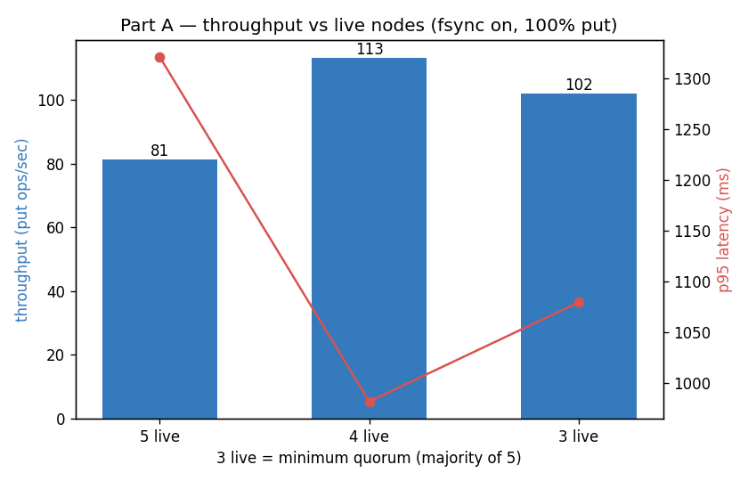
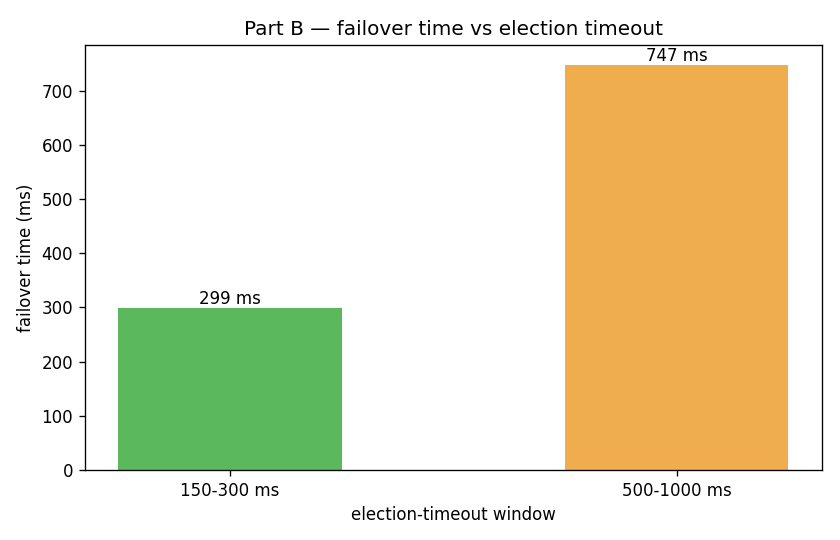
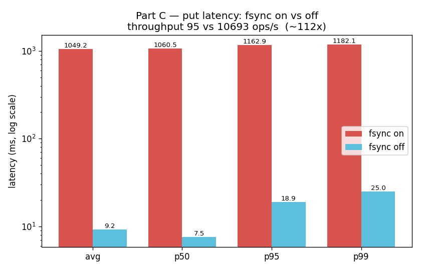

# Отчёт по бенчмаркам

Все прогоны выполнены на локальном кластере из 5 узлов (`127.0.0.1:9001..9005`), нагрузка 100 % `put`,
закрытый цикл (closed-loop) из `Bench` в CLI (постоянные соединения с лидером, перерезолв лидера при
`NOT_LEADER`). Сырые данные: [`benchmarks/results.csv`](benchmarks/results.csv); пересоздать — командой
`benchSuite` и `python3 benchmarks/plot.py`. Машина: Apple Silicon, SSD APFS, JDK.

> Про абсолютные числа. При `--fsync on` каждая дозапись в журнал вызывает `FileChannel.force(true)`,
> а сам узел — однопоточный actor, поэтому пропускная способность `put` упирается в латентность fsync
> на каждый коммит, а не в CPU. Важны **относительные** тренды ниже; абсолютные ops/s будут другими на
> другом диске. Конфигурация «5 узлов, fsync on» измеряется дважды (часть A и часть C) и даёт 81 против
> 95 ops/s — это **разброс ~17 % между отдельными прогонами** (прогрев JIT, джиттер латентности fsync,
> фоновая активность ОС), а не противоречие: значимы тренды внутри каждой части, замеренной подряд.

Данные внутренне согласованы: по закону Литтла для закрытого цикла `средняя задержка ≈ число потоков /
throughput`, и это выполняется на всех строках с точностью до ~1 % (например, 100 / 81 ≈ 1.23 c против
замеренных 1229 мс; 100 / 10693 ≈ 9.4 мс против 9.2 мс).

## Все прогоны

| часть | сценарий | живых | electionTimeout | fsync | потоки | всего оп. | throughput (ops/s) | avg мс | p50 | p95 | p99 | failoverMs |
|------|----------|-----:|-----------------|-------|-------:|---------:|-------------------:|-------:|----:|----:|----:|-----------:|
| A | 5 узлов живы | 5 | 150–300 | on | 100 | 10000 | **81** | 1228.8 | 1229.2 | 1320.9 | 1443.5 | — |
| A | 4 узла — 1 убит | 4 | 150–300 | on | 100 | 10000 | **113** | 882.3 | 883.6 | 981.8 | 1019.5 | — |
| A | 3 узла — 2 убиты (кворум) | 3 | 150–300 | on | 100 | 10000 | **102** | 980.2 | 988.9 | 1079.5 | 1138.3 | — |
| B | electionTimeout 150–300 | 5 | 150–300 | on | — | — | — | — | — | — | — | **299** |
| B | electionTimeout 500–1000 | 5 | 500–1000 | on | — | — | — | — | — | — | — | **747** |
| C | fsync on | 5 | 150–300 | on | 100 | 10000 | **95** | 1049.2 | 1060.5 | 1162.9 | 1182.1 | — |
| C | fsync off | 5 | 150–300 | off | 100 | 10000 | **10693** | 9.2 | 7.5 | 18.9 | 25.0 | — |

---

## Часть A — пропускная способность vs число живых узлов



Замерено: **5 → 81 ops/s** (avg 1229 мс), **4 → 113 ops/s** (avg 882 мс), **3 → 102 ops/s** (avg
980 мс). Throughput **немонотонна** — и это само по себе показательно.

**Почему throughput и latency меняются при убийстве узлов.** Каждый закоммиченный entry стоит лидеру
(а) одной дозаписи в журнал с `force` и (б) рассылки AppendEntries всем живым follower'ам и обработки их
ack — всё это на одном потоке event-loop'а. Два эффекта тянут в разные стороны:

- *Накладные расходы цикла/репликации* падают с числом peer'ов: 5 узлов ⇒ 4 AppendEntries + 4 ack на
  коммит; 3 узла ⇒ 2 + 2. Убийство первого follower'а снимает часть работы цикла на коммит и часть
  follower-`force`'ов, поэтому **5 → 4 даёт скачок с 81 до 113 ops/s**.
- *Запас кворума* исчезает на дне: коммит требует ack от большинства, поэтому при 4–5 узлах лидер
  коммитит, как только ответит **самое быстрое** большинство, и может игнорировать отстающего; при ровно
  3 узлах кворум — это **оба** выживших follower'а, и каждый коммит ждёт более медленного из двух. Из-за
  этой потери запаса **4 → 3 откатывается обратно к 102 ops/s**, хотя сообщений стало меньше.

Поэтому пик приходится на 4 живых узла. При закрытом цикле из 100 клиентов задержка ≈ конкурентность ÷
throughput (закон Литтла), так что средняя latency идёт обратно throughput'у (1229 → 882 → 980 мс).

**Почему 2 убитых — это предел.** Большинство от 5 — это `⌈6/2⌉ = 3`. При 3 живых узлах кворум — это
ровно эти 3, каждый коммит требует их всех. Убей третьего, и останется 2 (`2 < 3`): кворум не собрать,
лидер не может продвинуть `commitIndex`, и `put` возвращает `TIMEOUT`/`NO_LEADER`. То есть система
продолжает коммитить, **пока живо большинство**, и 2 отказа — это максимум, который переживает кластер из
5 узлов: ровно тот компромисс safety/availability, ради которого Raft и построен.

---

## Часть B — election timeout vs время failover



Замерено: **150–300 мс → 299 мс** failover; **500–1000 мс → 747 мс** failover (≈ в 2.5 раза медленнее).

`failoverMs` меряется от **мгновенного** краша лидера (SIGKILL через хэндл процесса — мягкий выход дал бы
старому лидеру дослуживать запросы и испортил бы замер) до первого `put`, который коммитится через нового
лидера.

**Почему меньший timeout восстанавливается быстрее.** Follower начинает выборы только после того, как не
слышит heartbeat в течение целого (рандомизированного) election timeout'а. Этот интервал тишины **и есть**
основная часть failover'а, поэтому уменьшение окна таймаута примерно вдвое сокращает время обнаружения:
настройка `150–300 мс` восстанавливается за несколько сотен мс, а `500–1000 мс` — заметно дольше.

**Почему нельзя просто поставить его крошечным.** Короткий timeout делает узлы «нервными»: краткая пауза
GC, медленный `force` диска или временная потеря пакетов заставят follower'а поверить, что лидер умер, и
начать ненужные disruption-выборы, отобрав лидерство у вполне здорового лидера и зря увеличив term.
Рандомизированное окно (и startup-grace на переподключающемся узле) держат split vote редким; слишком
малый timeout меняет эту стабильность на более быстрый, но более «шумный» failover. Стандартная
рекомендация — timeout ≫ интервала heartbeat/broadcast (здесь 50 мс), что `150–300 мс` соблюдает.

---

## Часть C — стоимость персистентности (fsync on vs off)



Замерено: **fsync on → 95 ops/s**, avg 1049 мс; **fsync off → 10693 ops/s**, avg 9.2 мс. Это разрыв
**≈ 112×** по throughput (и ≈ 114× по средней латентности, 1049 мс против 9.2 мс).

**Сколько стоит fsync.** `--fsync on` форсирует каждую дозапись журнала на стабильный носитель до того,
как узел ответит/реплицирует; `--fsync off` пишет только в страничный кэш ОС. Разница — это видимый выше
разрыв **≈ 112×** в throughput (и соответствующий разрыв в латентности): durability — это, безусловно,
самая дорогая вещь, которую узел Raft делает на «счастливом пути».

**Почему `off` некорректен после краша.** Safety Raft держится на инвариантах **log-before-reply**:
follower обязан иметь entry **durably** на диске до того, как ответит `success=true`, а узел обязан
записать `votedFor`/`currentTerm` durably до того, как ответит на голосование. При `off` `force` не
происходит никогда, поэтому потеря питания (или краш ОС) может потерять только что записанный хвост,
который уже был подтверждён. Конкретно: follower подтверждает entry, лидер засчитывает его в большинство
и коммитит, затем follower теряет этот entry при перезагрузке — и вот «закоммиченного» entry уже нет у
члена кворума, а up-to-date check будущего лидера может избрать лидера без него, нарушив Leader
Completeness. Аналогично потерянный `votedFor` позволяет узлу проголосовать дважды в одном term'е → два
лидера. Краш через `killNode` (краш процесса) переживается даже с `off`, потому что байты ещё лежат в
страничном кэше ОС; только реальная потеря питания вскрывает баг. Поэтому `off` — лишь потолок для
бенчмарка, а не рабочий режим.

---

## Воспроизведение

```bash
./gradlew clean jar
echo 'benchSuite --puts 10000 --threads 100
shutdownCluster
exit' | java -jar build/libs/raft.jar
python3 benchmarks/plot.py
```
